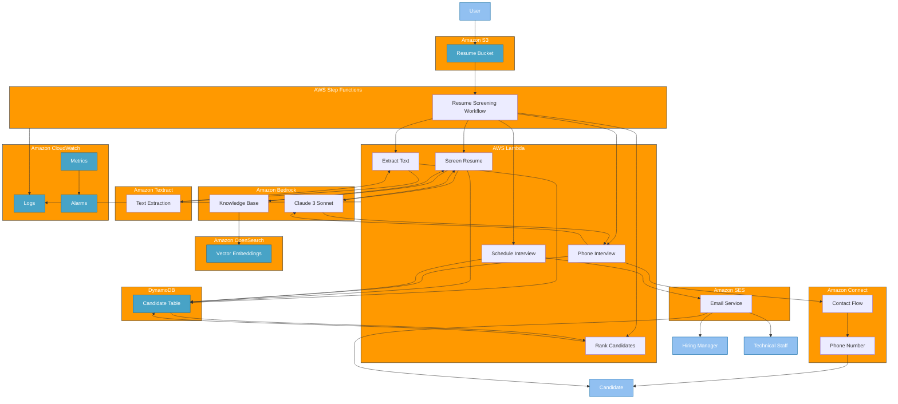

# AWS Phone-Based Chatbot Architecture

## Architecture Diagram

## Component Descriptions

### Storage and Data Components

- **Amazon S3**: Stores resume documents and call recordings
  - Resume Bucket: Central repository for all candidate resumes

- **Amazon DynamoDB**: NoSQL database for candidate tracking
  - Candidate Table: Stores candidate information, screening results, rankings, and interview status

- **Amazon OpenSearch**: Vector database for RAG capabilities
  - Vector Embeddings: Stores embeddings for semantic search of resumes

### Processing Components

- **AWS Lambda**: Serverless compute for various processing steps
  - Extract Text: Processes uploaded resumes using Textract
  - Screen Resume: Evaluates resumes against job requirements
  - Rank Candidates: Compares candidates and identifies top performers
  - Phone Interview: Manages phone call interactions
  - Schedule Interview: Handles interview scheduling logic

- **AWS Step Functions**: Orchestrates the end-to-end workflow
  - Resume Screening Workflow: Coordinates all steps with error handling

- **Amazon Textract**: OCR and document processing service
  - Text Extraction: Extracts structured data from resumes

### AI and Communication Components

- **Amazon Bedrock**: Foundation model service for AI capabilities
  - Claude 3 Sonnet: LLM for analyzing resumes and generating responses
  - Knowledge Base: RAG system for enhanced context understanding

- **Amazon Connect**: Cloud contact center service
  - Contact Flow: Define the customer interaction flow
  - Phone Number: Toll-free number for outbound calls

- **Amazon SES**: Email service for notifications
  - Email Service: Sends interview invitations and confirmations

### Monitoring and Logging

- **Amazon CloudWatch**: Monitoring and observability service
  - Logs: Centralized logging for all components
  - Metrics: Custom and service-level metrics
  - Alarms: Automated notifications for errors and thresholds

### External Entities

- **User**: HR or recruiting staff uploading resumes
- **Candidate**: Job applicant being screened and interviewed
- **Hiring Manager**: Department manager conducting interviews
- **Technical Staff**: Team members participating in technical interviews

## Data Flow

1. Resumes are uploaded to S3 by recruiting staff
2. Step Functions workflow is triggered by S3 event
3. Extract Text Lambda uses Textract to process resume documents
4. Screen Resume Lambda evaluates candidates using Bedrock
5. Rank Candidates Lambda identifies top candidates
6. Phone Interview Lambda conducts automated screening calls via Connect
7. Schedule Interview Lambda arranges interviews via email
8. All components log to CloudWatch for monitoring and troubleshooting

## Security Considerations

- All data at rest is encrypted
- IAM roles follow principle of least privilege
- Network traffic is encrypted in transit
- OpenSearch domain uses fine-grained access control
- S3 bucket blocks public access
- Lambda functions operate in secure VPC (recommended for production)