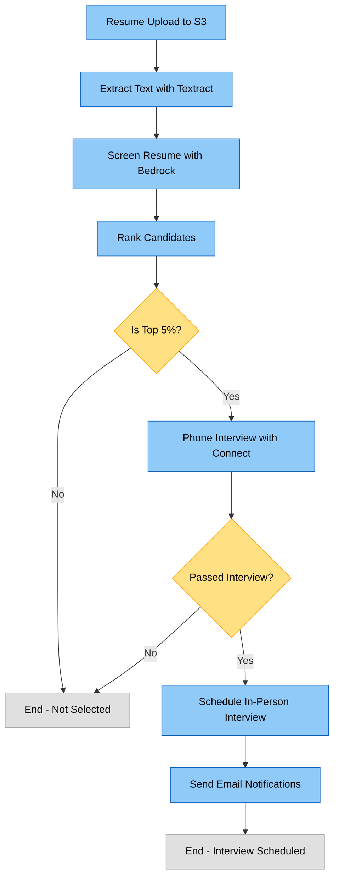

# Resume Screening and Interview Workflow

## Overview

This document provides a visual representation of the resume screening and interview workflow implemented in this project using AWS Step Functions.

## Workflow Diagram

## Process Steps

1. **Resume Upload to S3**
   * Resumes are uploaded to the S3 bucket following a specific path structure
   * Format: `s3://bucket-name/resumes/{job_id}/{candidate_id}.pdf`

2. **Extract Text with Textract**
   * AWS Textract extracts text content from PDF and Word documents
   * Text content is stored in DynamoDB for further analysis

3. **Screen Resume with Bedrock**
   * Amazon Bedrock (Claude 3 Sonnet) analyzes resume text against job requirements
   * Provides scoring, assessment, and identifies matching/missing skills

4. **Rank Candidates**
   * Compares candidates for the same job
   * Identifies candidates in the top 5% based on screening scores

5. **Phone Interview (if top candidate)**
   * Amazon Connect makes outbound calls to top candidates
   * Uses a personalized interview script generated by Bedrock
   * Conducts initial screening interview

6. **Schedule In-Person Interview (if passed phone interview)**
   * Finds available interview slots
   * Schedules interviews with hiring manager and technical staff
   * Sends email notifications to all parties

## Error Handling

The workflow includes comprehensive error handling at each step:

* Retry logic for transient failures
* Automatic notification of persistent errors
* Error state capture for debugging
* CloudWatch alarms for monitoring failures

## Monitoring

The entire process is monitored using Amazon CloudWatch:

* Lambda function errors
* Step Functions execution failures
* State transitions for auditing
* Custom metrics for success rates

## Customization

The workflow can be customized by modifying:

* Job descriptions in the `screen_resume.py` Lambda function
* Evaluation criteria and prompts in the Bedrock calls
* Phone interview scripts in the `phone_interview.py` Lambda function
* Step Functions state machine definition in `step_function.tf`